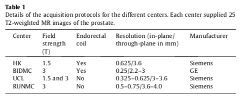
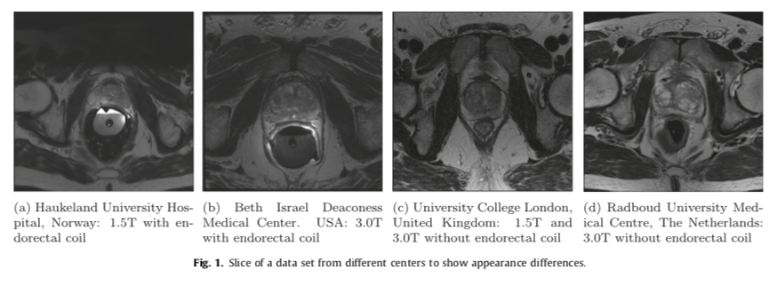
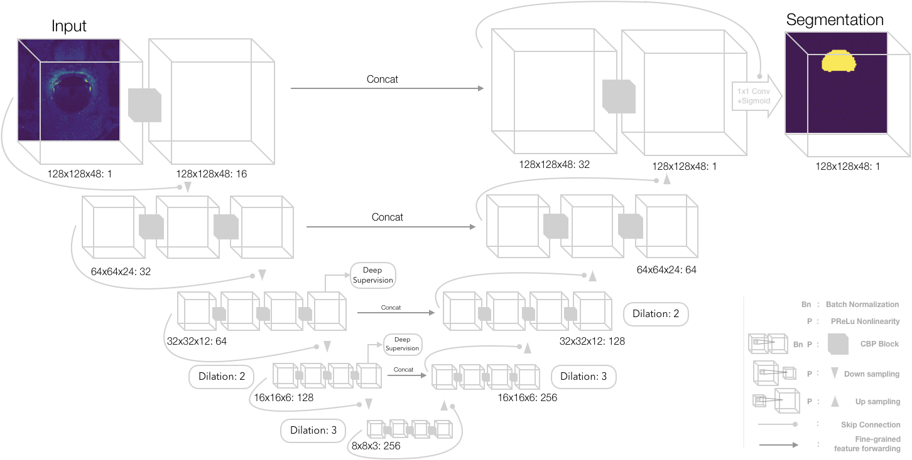

# 3D Prostate Segmentation from MR Images using FCNN
This repository contain files related to automatic prostate segmentation from MR Images using fully convolutional neural networks. The dataset is provided by PROMISE12 challenge. 

# About the files
- : Converts volume of different different sizes to same (128x128x64).
- : For reading the images and performing various augmentations.
- : File used for training the model.
- : File used for inferencing of trained model.
- : File for evaluating various metrics using predictions and actual labels. Metrics include Hausdorff Distance, Dice, boundary distance, volume difference, precision, recall and many more.

# Introduction

- Prostate cancer is among the most commonly diagnosed and leading causes of cancer related death in developed countries.
- The early detection of prostate cancer plays a significant role in the success of treatment and outcome.
- Radiologists first segment the prostate image from ultrasound image and then identify the hypoechoic regions which are more likely to exhibit cancer and should be considered for biopsy.
- Manual segmentation consumes considerable time and effort and is not only operator-dependent, but also tedious and repetitious.
- In this work we present an appraoch to segment prostate using Fully Convolutional Neural Networks without requiring the involvement of an expert.
- We were able to obtain results comparable to the state-of-the-art, with the average Dice loss of 0.92 and 0.80 on train and validataion set respectively.

# Data

- In MRI images, the voxel intensities and therefore appearance characteristics of the prostate can greatly differ between acquisition protocols, field strengths and scanners.
- Therefore a segmentation algorithm designed for use in clinical practice needs to deal with these issues.
- We decided to use the data from PROMISE12 challenge which included the scans from four different centers 
    - Haukeland University Hospital (HK), Norway
    - Beth Israel Deaconess Medical Center (BIDMC), United States
    - University College London (UCL), United Kingdom
    - Radboud University Nijmegen Medical Centre (RUNMC), Netherlands. 
- Each of the centers provided <b>25 transverse T2-weighted MR images</b>. This resulted in a total of <b>100</b> MR images. 
- Details pertaining to the acquisition can be found in the table below.

# Implementation

We used a modified V-net architecture for segmentation shown in the figure below.

# Training

We trained our model on different GPUs and got the following speedups.

| GPU configuration | Batch Size    | Average Time per Epoch (s) |
| ----------------- | ------------- | -------------------------- |
| Single K80        | 2             | 147                        |
| Dual k80          | 2 (1 per GPU) | 102                        |
| Single P100       | 2             | 48                         |
| Single P100       | 5             | 27                         |

## Evaluation Metrics

The metrics used in this study are widely used for the evaluation of segmentation algorithms:
1. <b>Dice coefficient</b>: To measure the similarity between output volumes.
2. <b>Absolute relative volume difference</b>: the percentage of the absolute difference between the volumes.
3. <b>Average boundary distance</b>: the average over the shortest distances between the boundary points of the volumes.
4. <b>95% Hausdorff distance</b>: the maximum of the shortest distances between the boundary points of the volumes. 95% percentile makes the metric less sensitive to outliers.

# Results

After training for 5000 epochs we got a dice loss of 0.92 and 0.80 on training and validation set. The results were then submitted to the MICCAI PROMISE12 challenge, and we received a score of <b>73.98</b> on the test set.
